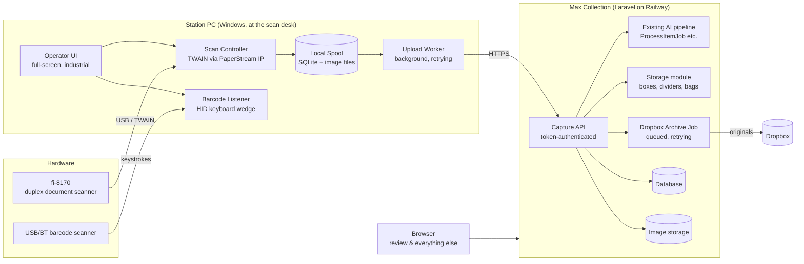
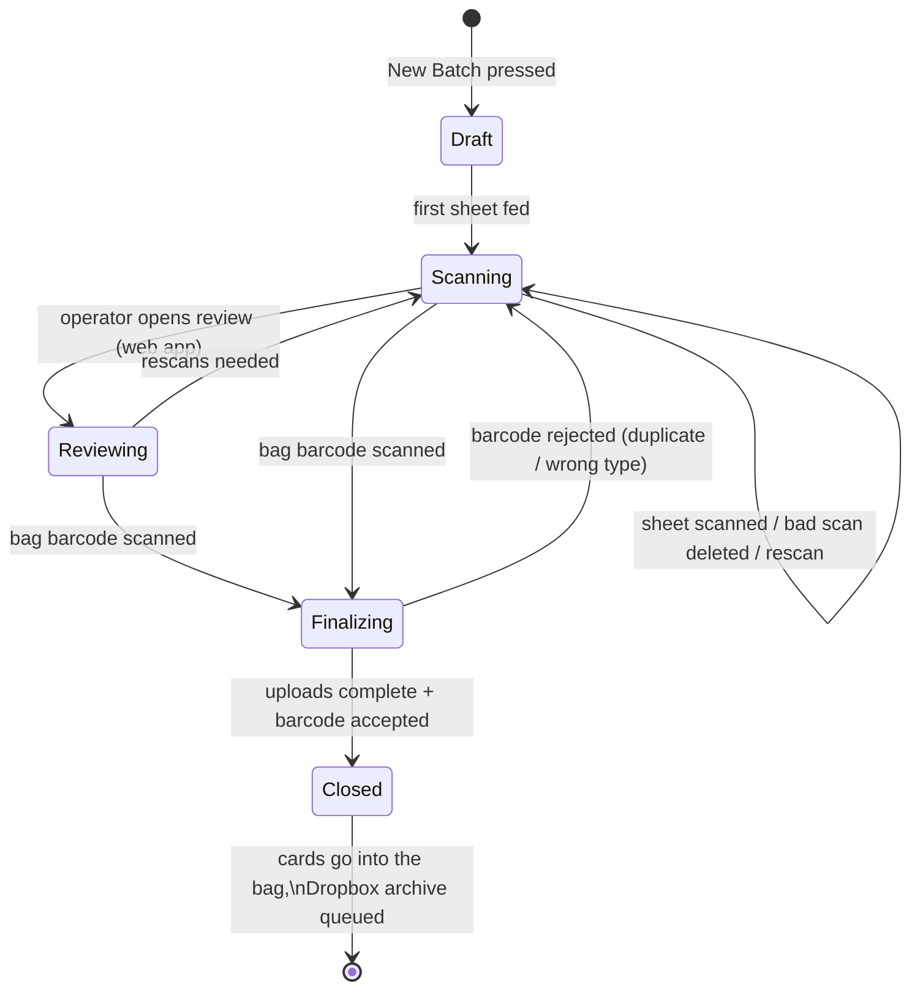
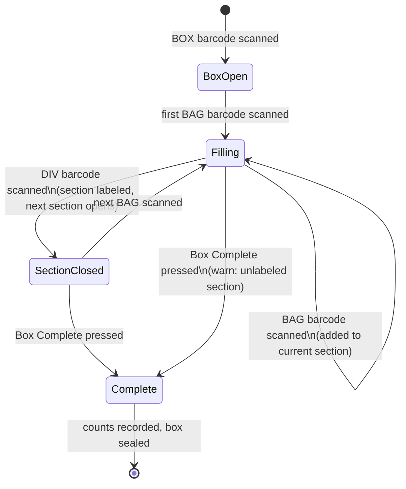
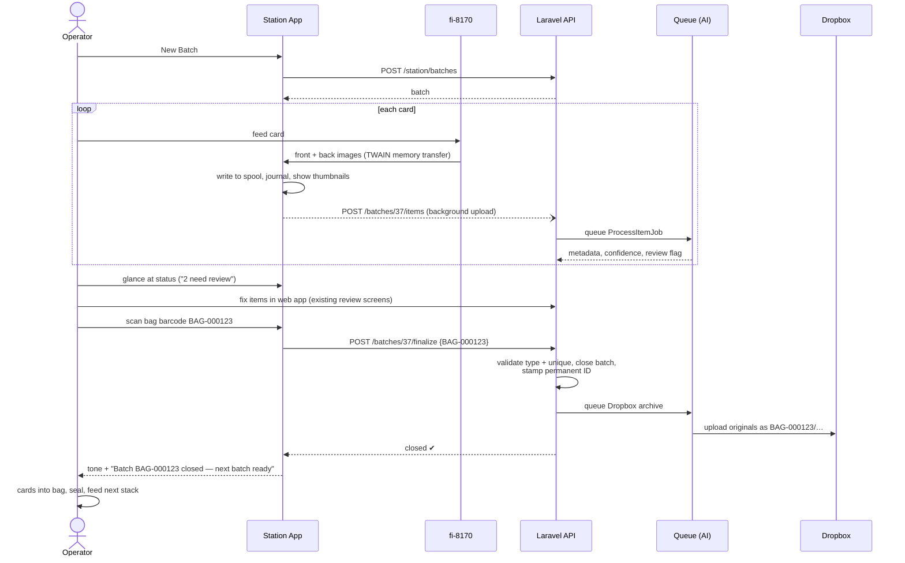
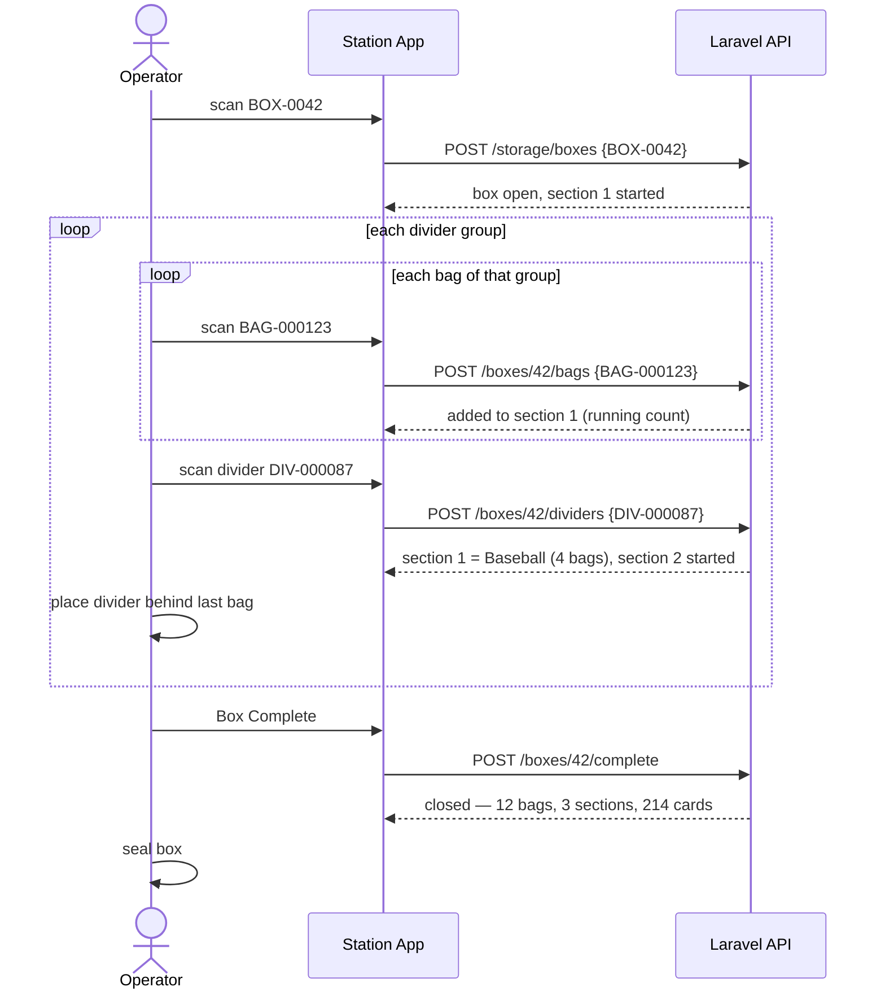

# Max Collection Capture Station — Architecture

Status: **APPROVED 2026-07-28** — all assumptions resolved (see "Approved
Decisions" at the end). Milestones 1 (Laravel storage foundation) and
2 (Dropbox archive) are complete; next per the build order is the Station
App skeleton (barcode workflows), then TWAIN integration on hardware.

This document is the response to the Capture Station design specification.
The specification defines WHAT the Capture Station is; this document defines
HOW it will be built. Implementation starts only after this architecture is
approved.

---

## 1. Overall Architecture

### The one constraint that shapes everything

TWAIN is a **desktop** technology. A browser page — served from Railway or
anywhere else — cannot open a TWAIN session with the fi-8170, cannot receive
image buffers from a driver, and cannot write files without a Save As dialog.
The spec's requirements (direct scanner control, no OS file dialogs, no
manufacturer software in the loop) are therefore only satisfiable by a
**native application running on the PC the scanner is plugged into**.

So the Capture Station is two pieces:

```
┌────────────────────────────┐         HTTPS (token-authenticated API)
│  STATION APP               │ ───────────────────────────────────────►
│  Windows desktop program   │         ┌───────────────────────────────┐
│  at the scanning desk      │         │  MAX COLLECTION (Laravel)     │
│                            │ ◄─────  │  on Railway — unchanged core: │
│  - drives the fi-8170      │         │  AI pipeline, review, search, │
│  - listens to the barcode  │         │  editing, reporting, export   │
│    scanner (HID)           │         │  + new: Capture API           │
│  - spools images locally   │         │  + new: Storage module        │
│  - uploads in background   │         │  + new: Dropbox archive job   │
└────────────────────────────┘         └───────────────────────────────┘
```

**The Station App is deliberately thin.** It acquires images, assigns them to
a batch, spools them to local disk, and uploads them. It holds no collection
data, runs no AI, and has no review screens. If the station PC dies, nothing
is lost that has been uploaded; if the network dies, scanning continues
against the local spool and uploads catch up when the connection returns.

**Laravel remains the single system of record.** Batches, items, images,
metadata, and the new storage hierarchy all live in the existing database.
The existing AI pipeline, review flow, and item model are reused as-is —
station-scanned cards become ordinary items in an ordinary batch.

The two workflows map onto this split cleanly:

- **Workflow 1 (Scanning)** runs mostly on the Station App (acquire, spool,
  upload) with Laravel doing what it already does (AI, review). Finalize is a
  single API call triggered by scanning a bag barcode.
- **Workflow 2 (Storage)** is barcode-only — no images, no scanner. It is a
  thin station screen making API calls, and can equally be operated from any
  browser with a barcode scanner focused on the page (HID scanners type into
  whatever has focus). We get a browser fallback for Workflow 2 for free.

### Physical vs digital independence

The storage hierarchy (Box → Divider → Bag) is a **new, separate set of
tables** that reference batches only by foreign key. Nothing in the metadata,
AI, or collection code reads them. Moving a bag between boxes touches storage
tables only. A card's metadata never changes because its location changes —
this is enforced by the schema, not by convention.

---

## 2. Component Diagram



Station App components:

| Component | Responsibility |
|---|---|
| **Operator UI** | One full-screen window. Shows current batch, live scan count, thumbnails of the last scans, upload progress, and big touchable buttons (New Batch, Rescan Last, Delete Last). Storage mode shows the open box and its sections. |
| **Scan Controller** | Owns the TWAIN session with the fi-8170. Configures duplex/resolution/color, starts scans, receives front+back image pairs in memory, hands them to the spool. Driver UI suppressed. |
| **Barcode Listener** | Captures scanner keystrokes (HID scanners terminate with Enter), parses the prefix to determine type (BAG/BOX/DIV), routes the event to whichever workflow is active. Rejects wrong-type scans with a loud error tone. |
| **Local Spool** | Crash-safe staging: every scanned image is written to disk and journaled in a local SQLite file before the UI confirms the scan. Survives app restarts and network outages. |
| **Upload Worker** | Drains the spool to the Capture API in the background with exponential-backoff retries. Scanning never waits for the network. |

Laravel additions:

| Component | Responsibility |
|---|---|
| **Capture API** | REST endpoints for the station (create batch, upload item images, batch status, finalize, storage operations). Token auth. Thin controllers over existing services. |
| **Storage module** | Boxes, sections (dividers), bag assignment. New tables, new service, simple screens in the web app for looking up "where is bag X". |
| **Dropbox Archive Job** | Queued job that uploads a finalized batch's original images to Dropbox, named by permanent Batch ID. Retries on failure; batch shows "archiving…" until done. |

---

## 3. Scanner Integration Approach

**Primary: TWAIN against the PaperStream IP driver, driven from .NET.**

- The fi-8170 ships with **PaperStream IP**, Ricoh/Fujitsu's TWAIN driver —
  widely regarded as one of the most reliable TWAIN implementations in the
  industry. We use the driver, not the scanning application.
- The Station App opens the TWAIN data source programmatically with the
  driver's UI suppressed (`ShowUI = false`), sets capabilities in code
  (duplex on, 300 dpi, color, auto paper-size detection, multifeed detection
  on), and receives images via **memory transfer** — buffers delivered
  straight into the app, never touching a driver-chosen file path. No Save As
  dialog can ever appear because no file dialog code path is exercised.
- Recommended library: **NTwain** (mature open-source .NET TWAIN wrapper).
  Fallback: Ricoh's **PaperStream IP SDK / fi Series web API** if NTwain
  hits driver quirks.
- Scan settings that matter for cards: duplex single-pass (front+back in one
  feed), 300 dpi color (matches current AI input quality with headroom),
  auto-crop to detected paper size **performed by the driver before the
  image reaches us** — this is scanner-hardware cropping of the platen area,
  not an edit of a stored original. What the driver delivers *is* the
  original, and from that moment rule §16 applies: never modified.
- Each sheet fed = one card = two images (front, back) = **one Item with two
  Images**, exactly matching the existing data model. Front/back roles are
  known mechanically from the duplex stream — no AI page-classification
  needed for station scans.

**Fallback mode: hot folder.** If TWAIN integration ever misbehaves on a
given machine, the Station App can instead watch a folder that PaperStream
ClickScan deposits into. Same spool, same uploads, same everything after
acquisition. This violates the "no manufacturer software" preference, so it
is strictly a break-glass fallback, but it means a driver problem can never
halt a scanning day.

**Barcode scanner:** plain HID keyboard wedge — no SDK, no driver. The
station listens for rapid keystroke bursts terminated by Enter. Because HID
scanners type into the focused window, the full-screen Station App always
has focus, and no clicking is needed between scans.

---

## 4. Recommended Technologies

| Concern | Choice | Why |
|---|---|---|
| Station platform | **Windows desktop app** | TWAIN requires it; fi-8170 drivers are Windows-first. |
| Station framework | **.NET 8 + WPF** | Single self-contained .exe, first-class TWAIN via NTwain, robust background workers, trivial SQLite. No runtime install needed (self-contained publish). |
| TWAIN library | **NTwain** | Mature, actively used, memory-transfer support. |
| Local spool | **SQLite + plain image files** | Crash-safe journal with zero administration. |
| Barcode input | **HID keyboard wedge** | Works with every commodity scanner, zero integration code beyond keystroke parsing. |
| Station→server auth | **Laravel Sanctum personal access token** | Already in the Laravel ecosystem; one long-lived token per station, revocable. |
| Server API | **Plain Laravel REST controllers** | Reuses existing services (CaptureService, ProcessingService). No new API framework. |
| Dropbox | **Laravel queue job + Dropbox API (spatie/flysystem-dropbox)** | Upload from the server, where the originals already live, with the queue's retry machinery. The station never needs Dropbox credentials. |
| Barcode labels | **Laravel-generated PDF label sheets** (Code 128) | Bags/boxes/dividers "already have barcodes" — something must print them; the web app generates Avery-compatible sheets on demand. |

Considered and rejected:

- **Electron + node-twain**: node TWAIN bindings are poorly maintained;
  worse reliability for the one thing the station must do perfectly.
- **Browser-only with a "scan bridge" localhost service**: two processes to
  install and keep alive instead of one, WebSocket plumbing, and the browser
  adds nothing — the station UI is deliberately not a browsing UI.
- **Scanning into the existing Bulk Capture web page**: exactly the "just
  another screen" approach the spec rules out; file-picker dialogs, no
  scanner control, no offline resilience.

---

## 5. Communication with the Laravel Application

Token-authenticated JSON over HTTPS, under `/api/station`. All endpoints are
idempotent where the physical process can repeat (re-scanning a barcode,
retrying an upload) so retries are always safe.

| Endpoint | Purpose |
|---|---|
| `POST /api/station/batches` | Create a draft batch (`source: station`). Returns temp batch ID. No name required. |
| `POST /api/station/batches/{batch}/items` | Multipart upload: front image + back image + station's local scan ID (dedupe key, so a retried upload never creates a duplicate item). Creates Item + 2 Images, queues AI processing. |
| `GET /api/station/batches/{batch}` | Status poll: item count, processed / needs-review counts, upload gaps. Drives the station's "ready to finalize?" display. |
| `POST /api/station/batches/{batch}/finalize` | Body: `{ barcode: "BAG-000123" }`. Validates barcode type + uniqueness, stamps the batch with its permanent ID, closes it, queues the Dropbox archive job. |
| `POST /api/station/storage/boxes` | Body: `{ barcode: "BOX-0042" }`. Opens a box (or errors if that barcode is closed). |
| `POST /api/station/storage/boxes/{box}/bags` | Body: `{ barcode: "BAG-000123" }`. Adds the bag to the box's current (open) section. Errors: unknown bag, bag already boxed. |
| `POST /api/station/storage/boxes/{box}/dividers` | Body: `{ barcode: "DIV-000087" }`. Closes the current section under that divider card and opens the next. |
| `POST /api/station/storage/boxes/{box}/complete` | Records close date + counts, seals the box. |

Web-app additions (browser, human-facing, not station):

- **Label sheets**: generate + print bag/box/divider barcode labels.
- **Storage lookup**: from an item or batch page, "Bag BAG-000123 · Box
  BOX-0042 · section Baseball"; from a box page, its sections and bags.
- Review stays exactly where it is today — the batch page in the web app.
  The station links/points the operator there ("batch 3: 2 items need
  review") but never re-implements review.

**AI processing trigger:** station uploads queue AI processing immediately
per item (no "Process" button press at the desk), so review status is ready
by the time a batch's last card is fed. The web app's manual flow is
unchanged.

---

## 6. State Machines

### Workflow 1 — Batch (scanning)



Batch states and rules:

| State | Meaning | Allowed events |
|---|---|---|
| `draft` | Created, nothing scanned | scan sheet, abandon |
| `scanning` | Cards being fed; AI runs concurrently server-side | scan, delete last, rescan, scan BAG barcode |
| `finalizing` | Bag barcode received; waiting for spool to drain | (automatic) |
| `closed` | Permanent bag ID assigned, archive queued | none — scanning this bag's barcode again is an error ("bag already used") |

Guard: finalize is accepted only when every spooled image for the batch has
reached the server. If uploads are still draining, the station shows
"finishing uploads — N remaining" and completes the finalize automatically
when the spool is empty. The operator can already bag the physical cards;
nothing waits on them.

### Workflow 2 — Box (storage)



Barcode-type routing: because the barcode prefix declares the object type,
the station never asks "what did you scan?" — a BOX scan while a box is open
is an error ("close this box first"), a BAG scan with no box open is an
error ("scan a box barcode first"), a DIV scan with an empty section is a
warning. Every error is a screen flash + tone, never a dialog to dismiss
with a mouse.

---

## 7. Database Changes Required

All changes are additive; nothing existing is altered in meaning.

**`batches` — new columns**

| Column | Type | Purpose |
|---|---|---|
| `barcode` | string(32), unique, nullable | Permanent bag ID, set at finalize. Null for web batches and unfinalized station batches. |
| `status` | string, default `open` | `open` / `closed`. Web batches stay `open` (unchanged behavior). |
| `finalized_at` | timestamp, nullable | When the bag barcode was scanned. |
| `archived_at` | timestamp, nullable | When the Dropbox upload completed. |
| `storage_section_id` | FK, nullable, nullOnDelete | Which box section the bag sits in. **The only link between digital and physical.** |

`source` gains a third value: `station` (alongside `bulk` / `pdf`).

**`storage_boxes` — new table**

| Column | Type |
|---|---|
| `barcode` | string(32), unique |
| `status` | `open` / `closed` |
| `closed_at` | timestamp, nullable |
| `bag_count`, `section_count`, `card_count` | integers, recorded at close |

**`storage_sections` — new table**

| Column | Type |
|---|---|
| `storage_box_id` | FK, cascade |
| `divider_barcode` | string(32), nullable until its divider is scanned |
| `position` | integer (order inside the box) |

**`station_tokens`** — via Laravel Sanctum's standard table (no custom
schema); one token per physical station.

Explicitly **not** stored: shelf/storage-room levels. The spec's hierarchy
mentions Storage → Shelf above Box, but neither workflow touches them. A
nullable `shelf_label` on boxes can be added the day it's needed —
per the simplicity rule, it is not built now.

**Item / image / metadata tables: zero changes.** Physical location lives
entirely in the tables above, which nothing in the AI, review, or collection
code reads.

---

## 8. Sequence Diagrams

### Scanning a batch, end to end



### Filling a storage box



Error paths (both workflows): a rejected barcode (unknown, duplicate, wrong
type, closed object) returns a structured error the station turns into a
tone + on-screen banner; the operator rescans or corrects. Images are never
involved in storage operations, so no error can lose a scan. A failed
Dropbox upload retries via the queue and surfaces on the batch page as
"archive pending" — it never blocks scanning.

---

## 9. Risks and Alternative Approaches

| # | Risk | Mitigation / alternative |
|---|---|---|
| 1 | **TWAIN/driver flakiness** on a specific PC or after a driver update. | PaperStream IP is best-in-class; still, the hot-folder fallback (§3) keeps scanning alive on the worst day. Pin the driver version on the station PC. |
| 2 | **Windows-only station.** If the scan desk ever runs macOS/Linux, TWAIN support for fi-8170 is Windows-centric. | Accept: buy/repurpose one Windows PC for the desk. (The fi-8170 also offers a vendor web-scan capability that could be explored later, but it reintroduces manufacturer software.) |
| 3 | **Barcode misreads / mistypes.** A misread BAG code would permanently misname a batch. | Code 128 with a check-suffix in our own label format; server validates the pattern strictly; finalize shows the ID full-screen for one glance before closing (tone + 2-second confirm, no keyboard). |
| 4 | **Duplicate physical labels** (a bag sheet printed twice). | `barcode` columns are unique; second use is rejected with "already used by batch closed on {date}". Label generator never reissues a code. |
| 5 | **Network outage mid-day.** | The local spool is the design center: scanning is fully offline-capable; uploads drain later; finalize waits for the spool automatically. |
| 6 | **Storage growth at 300k cards.** 600k originals ≈ hundreds of GB — more than Railway volumes comfortably hold. | Dropbox becomes the durable archive (already in the spec). Recommended follow-on decision: after `archived_at`, Railway keeps only derived images and fetches originals from Dropbox on demand. Not built now — flagged for a separate approval because it touches image-authority rule §16 (the original would live in Dropbox instead of Railway, still never modified). |
| 7 | **File renaming at finalize.** Physically renaming every stored file breaks the "originals are never touched" instinct and risks partial-rename states. | **Recommended deviation from the spec's letter:** keep internal storage paths immutable; the *permanent* naming (BAG-000123/card-007-front.jpg) is applied to the Dropbox archive copies and shown everywhere in the UI. The database mapping is the rename. Satisfies the intent (everything is addressable by permanent Batch ID) with zero rename risk. Needs owner sign-off. |
| 8 | **One station assumed.** Two stations scanning simultaneously would share the API fine (batches are independent) but the spec's "current batch" is per-station state — already handled since each station tracks its own current batch locally. Multi-station needs nothing extra now. | No action; noted so it isn't accidentally designed against. |
| 9 | **Dropbox API limits / token expiry.** | Queue retries with backoff; `archived_at` visibly null until success; Settings shows archive backlog count. |
| 10 | **Divider semantics drift** — physical categories (dividers) vs AI metadata categories could be conflated by future code. | Dividers are stored as opaque `divider_barcode` strings in storage tables only, never joined to metadata. The spec's rule is enforced structurally. |

---

## Approved Decisions (owner rulings, 2026-07-28)

1. **Windows PC at the scan desk** — confirmed.
2. **Labels are printed by us** — the web app generates Code 128 label
   sheets; the owner prints them, guided.
3. **Logical rename approved** — the permanent bag ID is applied in the
   database, the UI, and the Dropbox archive naming; stored original files
   are never renamed. Additionally, **every barcode is pre-registered at
   print time** (owner-requested): an unknown scan is instantly a misread,
   and printed-but-never-used labels are traceable.
4. **AI runs automatically on station uploads** — and always on the server
   (Railway), never on the scanning desk PC.
5. **Divider categories are free-form** — neutral DIV-xxxxxx codes with a
   printed display name, unrelated to AI metadata.
6. **Dropbox confirmed** — owner has 2 TB; full 300k-card archive projected
   at roughly 200–450 GB.
7. **Shelf level deferred** until a workflow needs it.

The owner's Milestone 1 review added ten binding requirements, reflected in
the implementation: registry-FK design everywhere (no copied code strings);
precise pending-section semantics; one open box **per user** (never a global
limit); undo + double-read protection + audit trail (`storage_events`);
finalize blocks on unprocessed items but not on Needs Review;
`finalized_at` distinct from `archived_at`; strict normalization
(`XXX-000000`, registry + type validated, never prefix alone); scanner-first
browser UX with an explicit "Start Packing Session" gesture; unlabeled final
sections preserved as "No Divider Assigned" after explicit confirmation;
snapshot counts that stay recalculable from relations.

## Station Operating Flow (owner walkthrough, 2026-07-29)

The owner walked the scanner's day end to end; these decisions bind the
Station App UI (Milestones 3–4):

1. **Touch-first.** The station runs on a touch screen; mouse and
   keyboard exist as backup only. No flow may require typing. Seconds
   matter: the per-handful loop is one tap.
2. **Session start:** log in (scanner account) → **collection first**
   (the standing rule) → capture mode (**Single cards**: one sheet =
   one card = front + back). Asked once per session.
3. **Temp batch** opens automatically on the first scan — no name, no
   typing — and is replaced by the printed bag barcode at finalize.
4. **The rhythm screen** offers two big buttons — **Load…** and
   **Scan** — plus a smaller **End Scanning** placed away from them.
5. **End Scanning is a pause, not a finish**: it requires two presses
   (End → Confirm, physically separated), then offers logout. The batch
   stays open server-side. On next login the station leads with
   **"Continue Batch — N cards so far"**; any scanner can continue any
   open station batch. This is the lunch-break flow.
6. **The true finish is Bag This Batch**: scan the bag barcode with the
   gun, cards into that bag, screen resets to a new batch. Review never
   blocks bagging.
7. **Time is captured on the whole process**: per handful (scan run),
   per session (login → end), per batch (opened → bagged), per
   operator. Feeds the Reports KPIs.
8. **KPIs** (Reports page; throughput/jam rows activate with station
   data): cards/hour per scanner, seconds per card, clean rate, rescan
   rate, jam rate per 1,000, backlog by stage, time-in-stage, progress
   vs 300k with pace projection, bagged/boxed per week, value & sales.

## The Comic Imaging Line (owner spec, 2026-07-29)

Two production systems exist, one per medium, both for RAW items only —
never bagged, never graded:

1. **Comics → the picture station** (panel line, below): front cover
   only, bare on the panel.
2. **Cards → the fi-8170 scanner**: front + back, duplex. Panels are
   not used for cards.

### The panel line

Assembly-line stations, each operator doing one task, panels
circulating: **Prep → Incoming queue → Camera → Outgoing queue →
Bagging → back to Prep.**

- **Panels**: ~24"×24", ~$7 each (board + furring strips + locating
  corners). Six comic positions, one bag-sticker position, and a
  permanent panel number. Scale: 2 prototype → 20 production → 30 if
  needed. Panel surface is matte and non-white (glare + empty-slot
  detection).
- **Prep** (45–90s/panel): six bare comics into the locating corners,
  bag sticker into its slot, stack in Incoming. Never touches the
  camera. Bag stickers print in pairs — one rides the panel and is
  photographed; its twin is applied to the physical bag at Bagging.
- **Camera** (10–15s/panel): fixed overhead camera, fixed lighting,
  manual focus/exposure, tethered to the station PC. Place panel,
  capture, move to Outgoing. **Instant validation**: the software
  checks barcode + panel ID readability the moment the frame lands and
  shows green ✓ / red ✗ while the panel is still in position.
- **Bagging** (35–60s/panel): comics into the bag in order, twin
  sticker onto the bag, bag into the collection box. Empty panel back
  to Prep.
- **Panel number** is printed human-readable AND as a barcode — QC,
  traceability, per-panel crop calibration, diagnostics.

### The self-documenting photograph

Every frame contains the six comics, the bag barcode, and the panel
ID. Software reads the barcode and panel number, crops the six comics
at fixed calibrated positions (no AI needed for cropping), creates a
batch **pre-bound to that bag** with six items, and queues normal AI
processing. Review never blocks bagging (standing rule).

**The full panel image is the sacred original** (rule §16); the six
crops are derived and regenerable. Dropbox archives the panel image
under the bag code.

Feasibility: a 24MP camera over 24" gives ~250 DPI — comic crops
~1650×2550px (more than the AI reads today) and the bag barcode is
trivially machine-readable in-frame.

Staffing estimate: prep is the bottleneck (camera idles ~75%); expect
to drift toward 2 preppers : 1 camera : 1–2 baggers. Line rate ≈
240–480 comics/hour with three people.

## Assumptions Requiring Approval (per CLAUDE.md §4)

1. **Windows PC at the scan desk.** The station app is a Windows desktop
   program (.NET). Confirm a Windows machine will drive the fi-8170.
2. **Label printing is ours.** "Every bag already contains a barcode"
   implies pre-printed labels; the web app will generate printable Code 128
   label sheets (bags, boxes, dividers). Confirm, or tell me labels come
   from elsewhere and specify their format.
3. **Logical rename, not physical rename** (risk #7 above): permanent
   BAG-xxx names are applied to the Dropbox archive and the UI, while
   internal storage paths stay immutable. Approve or require literal file
   renames.
4. **AI runs automatically on station uploads** (no Process button at the
   desk). The web bulk flow keeps its explicit Process button.
5. **Divider categories are free-form barcodes** (DIV-000087,
   DIV-000091, …) chosen when labels are printed — not tied to the AI's
   category/sport lists. Confirm.
6. **Dropbox account**: an app token (like the PriceCharting token) will be
   added to Railway when ready; archiving simply queues until it exists.
7. **Shelf level deferred** until a workflow needs it (§7).

## Suggested Build Order (after approval)

1. **Laravel first** (testable without hardware): storage tables + Capture
   API + finalize/close logic + label sheet generator + storage lookup
   screens. Fully verifiable with feature tests.
2. **Dropbox archive job** behind a config token.
3. **Station App skeleton**: barcode listener + Workflow 2 (storage) —
   proves the barcode loop end-to-end with zero scanner risk.
4. **TWAIN integration**: scan → spool → upload → finalize on real hardware.
5. **Hardening**: offline drills, misread drills, full-day dry run.

Each step is a milestone with its own approval gate, per CLAUDE.md §3.
